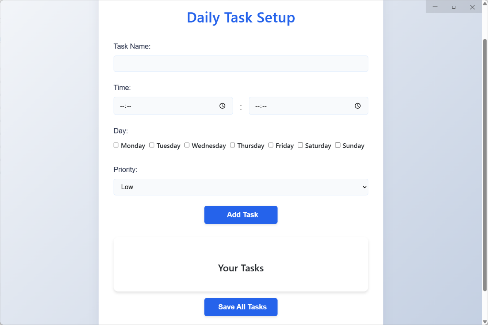
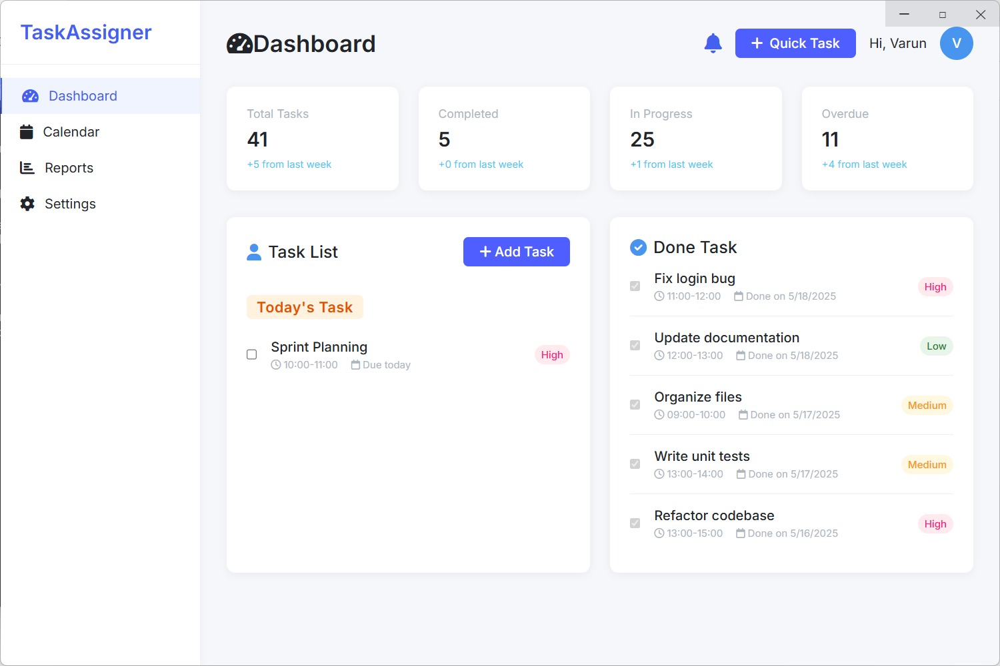
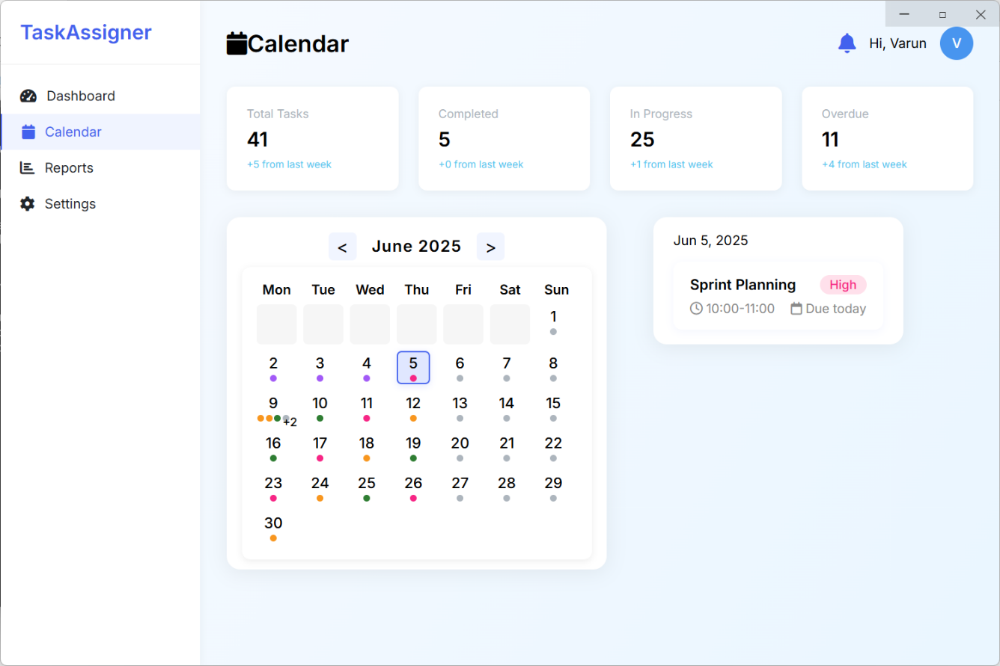
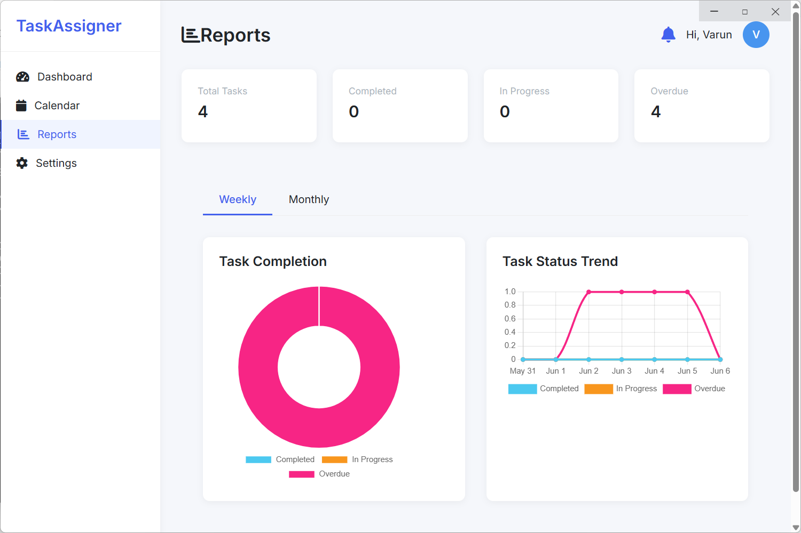
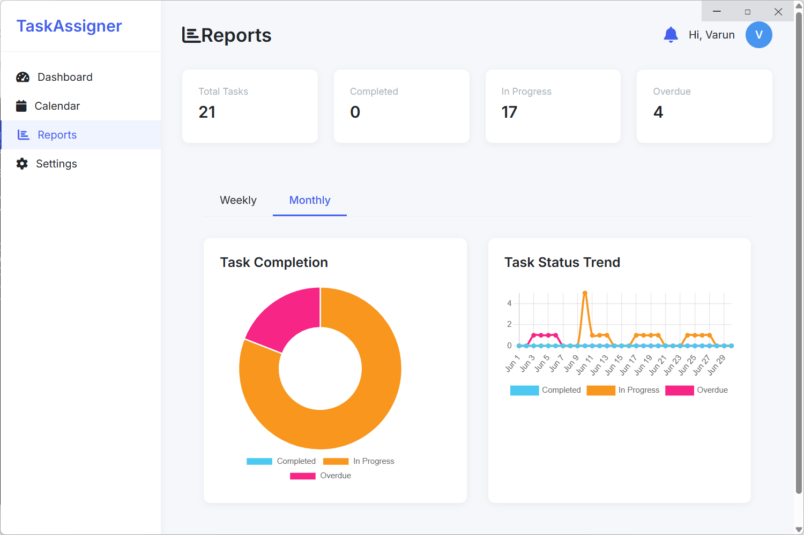
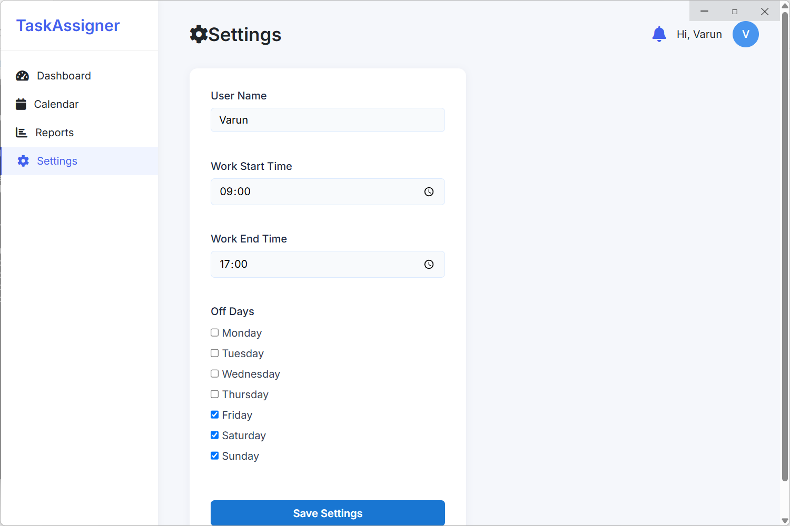
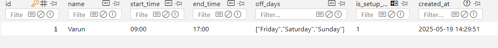
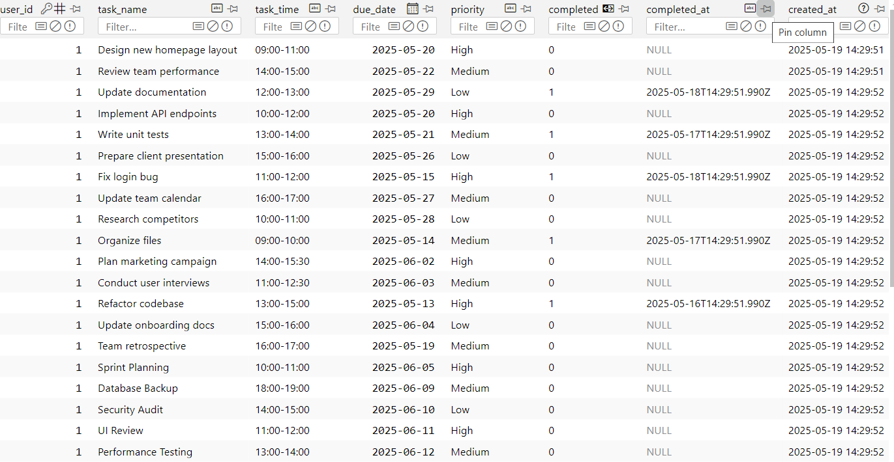

# Smart Task Scheduler pro

### **Introduction**
Smart Task Scheduler is a work focus task scheduling application built as a desktop app using Electron. It runs natively on desktop environments, providing offline access and system-level integrations. It employs HTML, CSS, and JavaScript for the user interface, Node.js for backend logic, and SQLite for local data storage, making it suitable for efficient task management on Windows.

Key Features
 - Desktop Focus: Built with Electron for a native desktop experience, unlike SyncForge's web-oriented fullstack setup.
 - Offline Capabilities: Runs independently without a browser, supporting features like system notifications and local file access.
 - Platform Integration: Leverages Electron's APIs for desktop-specific functionalities, such as tray icons or background processes.
 - Database: Uses SQLite for lightweight, local storage instead of MongoDB, enabling embedded database operations without external dependencies.
 - Intuitive Desktop UI: Responsive interface with HTML, CSS, and JavaScript, including drag-and-drop task organization and calendar views.
 - Backend Processing: Node.js handles API-like operations for task CRUD, user sessions, and scheduling logic.
 - Data Management: SQLite integration for persistent, local storage of tasks and user data, with support for offline operations.
---

### **Tech Stack**
Framework:
 - Electron for building cross-platform desktop applications.
Frontend:
 - HTML, CSS, JavaScript (potentially with frameworks like React for dynamic UI).
Backend:
 - Node.js with Express.js for handling logic and APIs.
Database:
 - SQLite for embedded, file-based data handling.

Example Key Functions
 - Create and schedule tasks with custom intervals or one-time events.
 - Receive desktop notifications for due tasks or updates.
 - View and filter tasks in a desktop-optimized layout, with search and sorting.
 - Secure local storage for user data and task history using SQLite queries
---

### **Installation & Setup**
Clone the repository:
```
git clone https://github.com/Varun-Singh-Rana/Smart-Task-Scheduler.git
cd Smart-Task-Scheduler
```
Install dependencies:
```
npm install
```
Run the application:
```
npm start
```
---

### **Contributing**

> Contributions are welcome! Please feel free to submit issues or pull requests.

---
### **Screenshots**
Login:
<br>


<br>
Dashboard:
<br>

<br>
Calendar:
<br>

<br>
Reports:
<br>


<br>
Settings:
<br>

<br>
Database:
<br>


